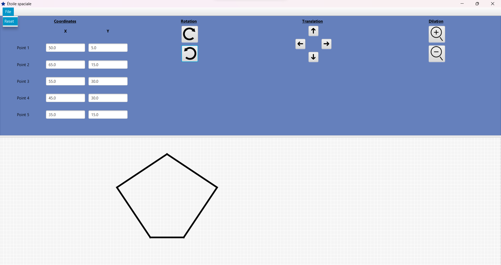
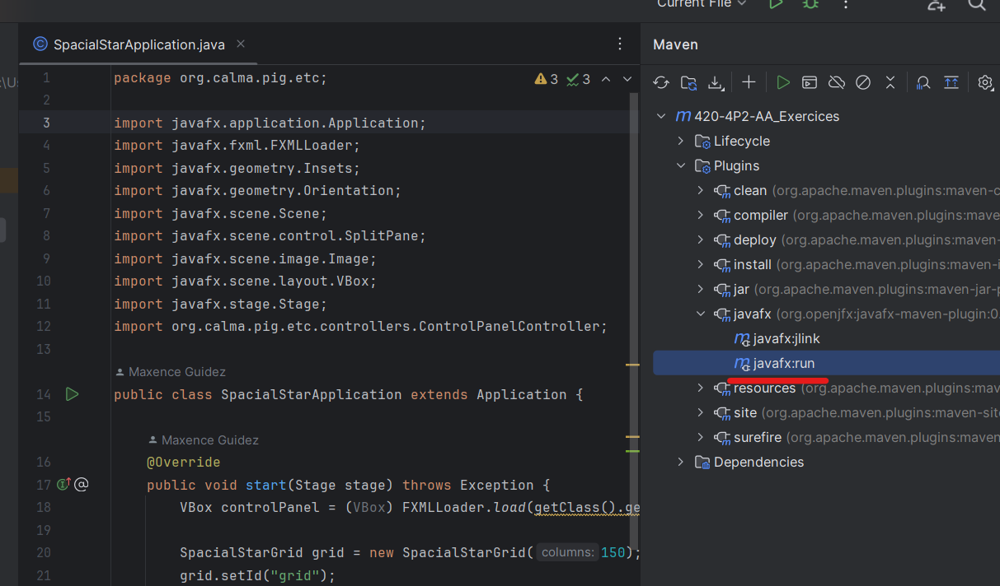

# SpacialStar
<mark>NOT WORKING FINE<mark>

## Overview
SpacialStar is a JavaFX project that allows users to create and customize a star in a graphical space. The application provides options to configure the star's properties such as scale, rotation, translation, and dilation.

> Final Examination for the Graphical User Interface Programming Course (420-4P2-AA / Winter 2023). Conditions: 12 days for completion.

## Table of Contents
- [Features](#features)
- [Technologies Used](#technologies-used)
- [Demo](#demo)
- [Getting Started](#getting-started)
- [License](#license)

## Features

- **Star Appearance**: Easily create a star and visualize it in the application's graphical space.
- **Configuration Options**: Customize the star using various options, including scale, rotation, translation, and dilation.
- **User-Friendly Interface**: The intuitive interface ensures a seamless experience for users of all levels.

## Technologies Used

- **Java**: The core programming language used to develop the application.
- **JavaFX**: The graphical user interface (GUI) framework for creating rich desktop applications.
- **SceneBuilder**: A visual layout tool for designing JavaFX application interfaces.
- **IntelliJ**: The integrated development environment (IDE) used for coding and managing the project.

## Demo



## Getting Started

1. **Prerequisites**: Make sure you have Java and IntelliJ installed on your machine.

2. **Clone the Repository**: Clone this repository to your local machine using the following command:
```console
git clone https://github.com/MaxenceGuidezCollege/SpacialStar.git
```

3. **Open in IntelliJ:** Open the project in IntelliJ IDEA.

4. **Run the Application:** Navigate to the options on the right side of Maven, go to Plugins > javafx > javafx:run to launch the SpacialStar application.


## Usage

1. **Run the Application**: Open the project in IntelliJ IDEA and navigate to the options on the right side of Maven. Go to Plugins > javafx > javafx:run to launch the SpacialStar application.

2. Upon launching the application, a star will be displayed in the graphical space.

3. Navigate to the configuration panel to adjust the star's properties.

4. Experiment with different options such as scale, rotation, translation, and dilation to customize the appearance of the star.

## License

This project is licensed under the MIT License - see the [LICENSE](LICENSE.md) file for details.
